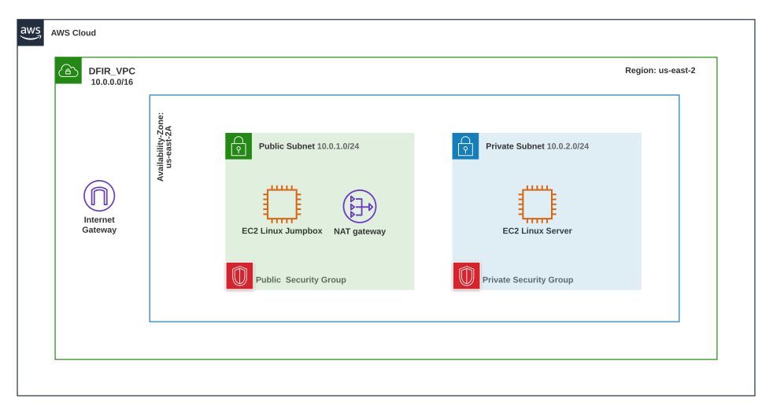

# AWS VPC Builder
Terraform Template that builds AWS VPC including: Internet Gateway, Public / Private Subnets, Public/ Private Route Table / Route / Route Table Association, Security Groups, NAT Gateway with Elastic IP, Linux EC2 Jumpbox In Public Subnet & Linux Server in Private Subnet.  

---------------------------------------------------------------------------------------------------------------------

### AWS VPC Network Topology:


----------------------------------------------------------------------------------------------------------------------

### Description of the AWS resources in Terraform VPC build

#### Step 1: Set AWS configurations:
These environment variables specified here are detected by the AWS CLI and AWS SDKs to utilize a particular region and IAM credentials for future API calls made. 

#### Step 2: Create VPC Resource
A dedicated virtual network that allows customized resources to be specifically allocated to it. Much like a traditional on-premises network, however, its remote and the infrastructure is highly scalable.

#### Step 3: Create Internet Gateway Resource
Can be attached to the VPC in order to facilitate an internet connection between specific VPC resources and the public internet.   

#### Step 4: Create Public & Private Subnet Resource(s)
Each subnet mentioned represents a unique range of IP addresses within the VPC that will include different resources. For example: instances placed inside them and the security groups applied to them.   

#### Step 5: Create Public & Private Route Table / Route & Route Table Association Resource(s)
Specific operations that dictate where the network traffic goes.  For example: Network traffic originating from instances within the Public subnet that is destined for the internet is directed through the IGW.

#### Step 6: Create Public and Private Security Groups Resource(s)
Filters traffic similarly to a fire wall in order to facilitate specific inbound and outbound traffic for particular instances or subnets within the VPC. 

#### Step 7: Create NAT Gateway & EIP Resource
Placing a NAT Gateway in a Public subnet of a VPC allows instances in a private subnet to utilize an Elastic IP or a static, public IP address to securely access the Internet.  

#### Step 8: Create EC2 Instances Resource(s)
This is virtual hardware which can be pre configured with AMIs to run a particular system. EC2 instances can be customised to meet storage, network and security needs. 


-------------------------------------------------------------------------------------------------------------------------------------------


### Write Terraform main.tf file 
[see source code for an example of how to write & customize variables.tf to suit individual network designs]


#### Step 1: Set AWS configurations:
```
AWS_Provider
Attributes:  access_key  |  secret_key  |  region
```
Specifying Provider credentials will allow the terraform templates to run and build on the associated AWS account.

Figure 1: AWS configs
```
# set AWS config vars [region / access / secret] 

provider "aws" {
      region     = var.region
      access_key = var.access_key
      secret_key = var.secret_key
}
```

#### Step 2: Create VPC Resource
```
VPC
IP Range:  [10.0.0.0/16]

Attributes:
Cidr_block, enable_dns_support, enable_dns_hostnames, tags
```
At this point, this VPC does not contain essential resources. Therefore, this is not yet a useful network, rather a container for one. 

Figure 2: VPC
```
# create VPC 
resource "aws_vpc" "default" {
  cidr_block           = var.cidr_block
  enable_dns_support   = true
  enable_dns_hostnames = true
  tags = {
    Name="dfir_vpc"
  }
}
```

#### Step 3: Create Internet Gateway Resource
```
Internet Gateway  [dfir_gw]
Attributes:  vpc_id, tags 
```
This Internet Gateway is attached to the default VPC that was configured in the previous step. It will route traffic from the VPC EC2 instances to the public internet. 

Figure 3: IGW
```
# create internet gateway
resource "aws_internet_gateway" "default" {
  vpc_id = aws_vpc.default.id
  tags = {
    Name="dfir_gw"
  }
}
```

#### Step 4: Create Public & Private Subnet Resource

```
Public Subnet  [dfir_public_subnet]
IP Range: [10.0.1.0/24]

#-----------------------------------

Private Subnet  [dfir_private_subnet]
IP Range: [10.0.2.0/24]

#-----------------------------------

Attributes: vpc_id, cidr_block, availibility_zone, map_public_ip_on_launch
```

Both the Public and Private subnets will each encapsulate a unique range of network IP’s.  Each will specify a custom variable that defines the range. 
Ex: public_subnet_cidr_block / private_subnet_cidr_block. 
The availability zone is an optional attribute but useful when there is a need for resources to be replicated across multiple availability zones within a region for redundancy / disaster recovery / availability. 

Figure 4: Pub/Priv Subnets
```
# create public subnet
resource "aws_subnet" "dfir_public_subnet" {
  vpc_id                  = aws_vpc.default.id
  cidr_block              = var.public_subnet_cidr_block
  availability_zone       = var.availability_zone
  map_public_ip_on_launch = true
  tags = {
    Name="dfir_public_subnet"
  }
}

# create private subnet
resource "aws_subnet" "dfir_private_subnet" {
  vpc_id                  = aws_vpc.default.id
  cidr_block              = var.private_subnet_cidr_block
  availability_zone       = var.availability_zone
  map_public_ip_on_launch = true
  tags = {
    Name="dfir_private_subnet"
  }
}
```

#### Step 5: Create Public & Private Route Table, Route & Route Table Association Resources
```
Public & Private Route Table        ===>  Attributes:  vpc_id, tags 
Public & Private Route              ===>  Attributes:  route_table_id, destination_cidr_block, gateway_id/nat
Public & Private Rt Table Assoc.    ===>  Attributes: subnet_id, route_table_id
```
##### Pubic Route  [dfir_public_rt]
Network traffic originating from instances within the Public subnet that is destined for the public internet is directed through the Internet Gateway.

```
Destination  :  10.0.0.0/16   |   Target  : Local
-----------------------------------------------------------
Destination  :  0.0.0.0/0     |   Target  : IGW
```

##### Private Route [dfir_private_rt]
Network traffic originating from instances within the Private subnet that is destined for the public internet is first routed to the NAT Gateway and then to the Internet Gateway. 

```
Destination  :  10.0.0.0/16   |   Target  : Local
-----------------------------------------------------------
Destination  :  0.0.0.0/0     |   Target  : NAT
```

Figure 5: Pub/Priv Routes 
```
# Public route table / route / route table association
# --------------------

# create route table (public)
resource "aws_route_table" "dfir_public_rt" {
  vpc_id = aws_vpc.default.id
  tags = {
    Name="dfir_public_rt"
  }
}

# create route (public)
resource "aws_route" "public" {
  route_table_id         = aws_route_table.dfir_public_rt.id
  destination_cidr_block = "0.0.0.0/0"
  gateway_id             = aws_internet_gateway.default.id
}

# create route table association (public)
resource "aws_route_table_association" "public_subnet_association" {
  subnet_id      = aws_subnet.dfir_public_subnet.id
  route_table_id = aws_route_table.dfir_public_rt.id
}


# Private route table / route / route table association
# ---------------------

# create route table (private)
resource "aws_route_table" "dfir_private_rt" {
  vpc_id = aws_vpc.default.id
  tags = {
    Name="dfir_private_rt"
  }
}

# create route (private)
resource "aws_route" "private" {
  route_table_id         = aws_route_table.dfir_private_rt.id
  destination_cidr_block = "0.0.0.0/0"
  nat_gateway_id         = aws_nat_gateway.dfir_nat_gw.id
}

# create route table association (private)
resource "aws_route_table_association" "private_subnet_association" {
  subnet_id      = aws_subnet.dfir_private_subnet.id
  route_table_id = aws_route_table.dfir_private_rt.id
}
```

#### Step 6: Create Public and Private Security Groups

```
Public & Private Security Groups [public_sg] & [private_sg]
Attributes: vpc_id, tags, specific ingress / egress rules
```

Once attached to a specific VPC id, Security Groups contain sets of rules which are then applied to specific instances to control inbound / outbound traffic. 
Ex: The Public Security Group will allow for inbound SSH connections from one IP address outside of the VPC.  This can be useful for a jumpbox.  Additionally, Private Security Group instances can listen for inbound SSH connections from other machines within the VPC, including the jumpbox in the public subnet. 

Figure 6: Pub/Priv Security groups 
```
# create security group(s)


# create public security group. For instances inside pulic subnet
# allows inbound SSH connections from extenal desktop to Jumpbox
resource "aws_security_group" "public_sg" {
  name = "public_sg"
  description = "Public security group"

  ingress {
    from_port = 22
    to_port = 22
    protocol = "tcp"
    cidr_blocks = [var.external_cidr_block] 
  }
  
  vpc_id = aws_vpc.default.id

  tags = {
    Name = "public_sg"
  }

}

# create private security group. For instances inside private subnet 
# allows SSH connections from other internal machones (vpc)
resource "aws_security_group" "private_sg" {
  name = "private_sg"
  description = "Private security group"

  ingress {
    from_port = 22
    to_port = 22
    protocol = "tcp"
    cidr_blocks = [var.cidr_block] 
  }
  
  vpc_id = aws_vpc.default.id

  tags = {
    Name = "private_sg"
  }

}
```

#### Step 7: Create NAT Gateway & EIP
```
Attributes: vpc_id, depends_on, allocation_id, subnet_id
```
The NAT Gateway will exist in the public subnet to service network traffic via Elastic IP from the private subnet instance(s).  Additionally, this traffic will then route to the Internet Gateway to reach the destination. 

Figure 7: NAT
```
# create elastic IP for NAT gateway
resource "aws_eip" "nat" {
  vpc = true
}

# create a NAT gateway in Public Subnet
resource "aws_nat_gateway" "dfir_nat_gw" {
  depends_on = [aws_internet_gateway.default]
  allocation_id = aws_eip.nat.id
  subnet_id     = aws_subnet.dfir_public_subnet.id
}
```

#### Step 8: Create EC2 Instances
```
EC2 instance in Public Subnet [dfir jumbox]
EC2 instance in Private Subnet [dfir compromised instance]

Attributes:  ami, availibility_zone, instance_type, subnet_id,  vpc_security_group_ids, key_name, associate_public_ip_address, source_dest_check, tags
```

The EC2 instances created will both be built from Linux AMIs. The Public Subnet instance will function as a jump box to securely connect to a linux server in the Private subnet.  

Figure 8: EC2 Instances 
```
# create instance(s)

# create ubuntu 18 server jump box in public subnet
resource "aws_instance" "dfir_jumpbox" {
  ami = var.ami_id
  availability_zone = var.availability_zone
  instance_type = var.instance_type
  subnet_id = aws_subnet.dfir_public_subnet.id
  vpc_security_group_ids = [aws_security_group.public_sg.id] 
  key_name = var.key_name
  associate_public_ip_address = true
  source_dest_check = false
  tags = {
    Name = "dfir jumpbox"
  }
}

# create ubuntu 18 server compromised instance in private subnet
resource "aws_instance" "dfir_compromised_instance" {
  ami = var.ami_id
  availability_zone = var.availability_zone
  instance_type = var.instance_type
  subnet_id = aws_subnet.dfir_private_subnet.id
  vpc_security_group_ids = [aws_security_group.private_sg.id] 
  key_name = var.key_name
  associate_public_ip_address = false
  source_dest_check = false
  tags = {
    Name = "dfir compromised instance"
  }
}
```


